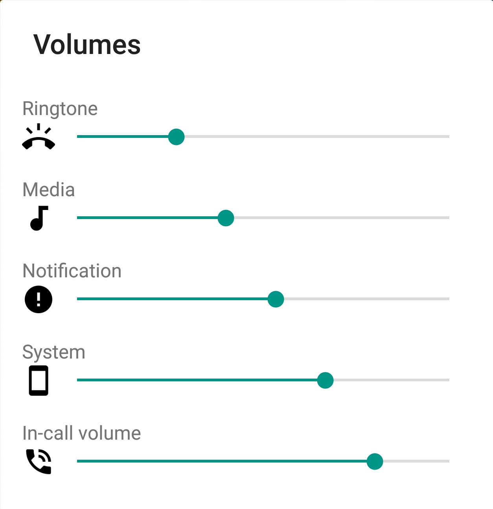
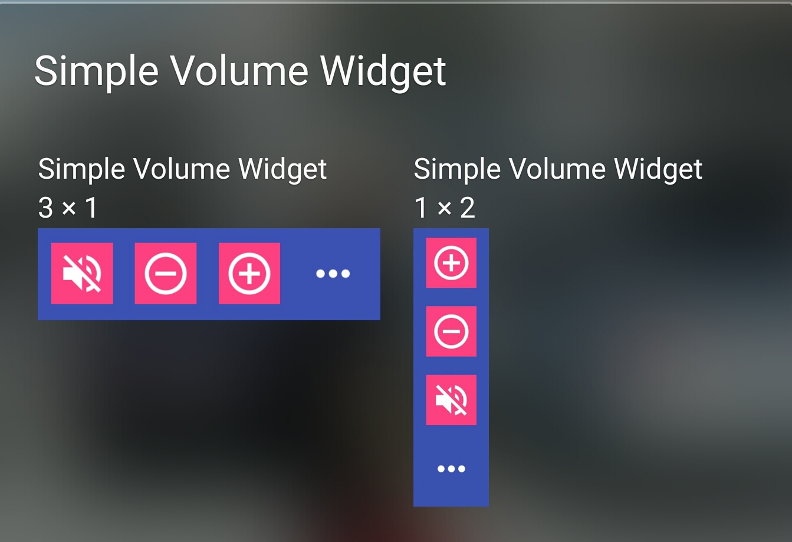

# VolumeKeys

The volume keys of my phone stopped working so I had to come up with a simple project.

## Images
Icons are downloaded from [Material.io](material.io) and the drawable images are downloaded from [unsplash.com](unsplash.com).

## Translations
Translations for the strings are downloaded from [Android Open Source Project](https://source.android.com/source/licenses). It was the easiest way to avold reinventing the wheel.

## Simple Volume Widget App
App is also available at Google Play [Simple Volume Widget](https://play.google.com/store/apps/details?id=org.ipforsmartobjects.apps.volumekeyswidget&hl=en)

## Screenshots



## License
```
Copyright 2017 Hamid Mukhtar

Licensed under the Apache License, Version 2.0 (the "License");
you may not use this file except in compliance with the License.
You may obtain a copy of the License at

    http://www.apache.org/licenses/LICENSE-2.0

Unless required by applicable law or agreed to in writing, software
distributed under the License is distributed on an "AS IS" BASIS,
WITHOUT WARRANTIES OR CONDITIONS OF ANY KIND, either express or implied.
See the License for the specific language governing permissions and
limitations under the License.
```

